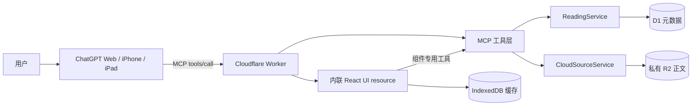

# 和G老师一起读书

一个运行在 ChatGPT 中的移动端优先私人阅读器。它把多书书架、阅读进度、划线想法、书签和“与G老师共读当前页”连接在同一个 MCP App 中。

公开仓库只包含源代码、测试和原创 demo，不包含维护者的线上地址、Cloudflare 资源标识、连接令牌、书籍正文、批注、聊天或阅读记录。

> 当前冻结版本：`0.3.34`
> 公开发布标签：`v0.3.34`

## 设计目标

- 在 ChatGPT Web、iPhone 和 iPad 宿主中使用同一份 React 组件。
- 支持粘贴文本和导入 TXT、Markdown、EPUB。
- 支持多本书，而不是为单本样书写特殊逻辑。
- 让正文保持私密，同时允许用户主动分享当前页与想法进行共读。
- 允许设备缓存丢失后从私人云端恢复正文和阅读状态。

## 核心功能

- 多书书架、筛选、详情页和阅读记录
- 你的阅读位置与G老师的已读位置分离
- 划线、想法、清思、纪要、书签及删除管理
- 水蓝、粉桃、米白、浅绿和柔墨绿主题
- IndexedDB 本地缓存
- D1 元数据与私人 R2 正文存储
- 当前页上下文的只读共读工具
- ChatGPT Web、iPhone、iPad 响应式界面

## 架构概览



关键点：工具执行成功、数据返回成功、UI resource 可读取、宿主完成挂载、用户可以交互，是五个不同的状态。浏览器成功也不能替代 iPhone 或 iPad 真机验收。

详细说明见 [架构与设计思路](docs/ARCHITECTURE.md)。

## 项目结构

```text
shared/  共享数据模型、Zod schema、数据库迁移与小说分段
server/  MCP 工具、UI resource、Worker、D1/R2 服务与隐私边界
web/     React 阅读器、ChatGPT host bridge、IndexedDB 与主题样式
demo/    可公开使用的原创示例文本
docs/    架构、部署、维护与学习资料
```

## 本地开发

要求：Node.js 22+、Corepack、pnpm 10.15.1。

```bash
git clone https://github.com/ice-star-blue/ss-reading-nest.git
cd ss-reading-nest
corepack pnpm@10.15.1 install
corepack pnpm@10.15.1 test
corepack pnpm@10.15.1 typecheck
corepack pnpm@10.15.1 build
```

本地开发：

```bash
corepack pnpm@10.15.1 dev
```

默认本地端点：

- MCP：`http://localhost:8787/mcp`
- 健康检查：`http://localhost:8787/health`

## 部署到自己的 Cloudflare

该项目默认是个人单用户部署。不要把维护者或其他人的 MCP 地址作为自己的后端。

1. 创建 D1 数据库和私有 R2 bucket。
2. 把 `server/wrangler.jsonc` 中的占位数据库 ID 改成自己的值。
3. 创建随机 `MCP_PATH_TOKEN`，仅通过 Wrangler secret 保存。
4. 应用迁移并部署 Worker。

```bash
corepack pnpm@10.15.1 --filter @ss/server exec wrangler login
corepack pnpm@10.15.1 --filter @ss/server exec wrangler d1 create ss-reading-nest-db
corepack pnpm@10.15.1 --filter @ss/server exec wrangler r2 bucket create ss-reading-nest-sources
corepack pnpm@10.15.1 --filter @ss/server exec wrangler secret put MCP_PATH_TOKEN
corepack pnpm@10.15.1 --filter @ss/server exec wrangler d1 migrations apply ss-reading-nest-db --remote
corepack pnpm@10.15.1 deploy:cloudflare
```

连接地址由你自己的 Worker origin 和私密 token 组成：

```text
https://<your-worker>.<your-subdomain>.workers.dev/mcp/<your-random-token>
```

原生客户端兼容入口使用当前后缀：

```text
https://<your-worker>.<your-subdomain>.workers.dev/mcp/<your-random-token>/ios-v4
```

不要把实际地址发到 issue、日志或截图里。完整步骤见 [开源部署指南](docs/OPEN_SOURCE_DEPLOYMENT.md)。ChatGPT App/MCP 的官方概念可参考 [OpenAI MCP server 指南](https://developers.openai.com/apps-sdk/build/mcp-server/) 与 [ChatGPT UI 指南](https://developers.openai.com/apps-sdk/build/chatgpt-ui/)。

## 数据与隐私

| 位置 | 保存内容 | 性质 |
| --- | --- | --- |
| D1 | session、进度、偏好、批注、书签、阅读记录、source metadata | 私有结构化数据 |
| R2 | 导入的小说正文和 manifest | 必须保持 private |
| IndexedDB | 当前设备的正文与分段缓存 | 可重建缓存 |
| ChatGPT 上下文 | 用户主动共读时所需的当前页与想法 | 最小必要范围 |

服务端会在书架数据离开内部存储边界前移除 R2 `objectKey` 和 `manifestObjectKey`。项目不需要 `OPENAI_API_KEY`，模型由 ChatGPT 宿主提供。

IndexedDB 只承担加速缓存，不是唯一数据源。正文上传和恢复使用 component-only 的组件通道；ChatGPT 模型不会自动读取整本小说。R2 保持私有，本项目不生成 public URL 或 signed URL。

删除操作分为三个明确层次：删除云端阅读记录、同时删除云端正文副本、同时删除本设备正文缓存。使用者应根据自己的保留需求确认范围。

部署后的 remote smoke 只应使用临时原创文本，并在完成后清理测试 session 与对象。

随机路径 token 不是完整的多用户认证。公开提供托管服务前，必须增加真正的身份认证、授权、用户隔离、限流、删除和滥用防护。详见 [安全策略](SECURITY.md)。

## 共读为什么不把整页塞进聊天

组件只发送一句简短的共读意图。模型随后调用无 UI 绑定的只读工具 `read_shared_page_context`，从 R2 恢复当前页、从 D1 获取该页想法，再直接回应用户观点。这样模型获得必要上下文，但聊天界面不会变成正文和批注的复读机。

## 测试基线

公开前在冻结源码上验证：

- shared：34 项通过
- server：87 项通过
- web：173 项通过，1 项按设计跳过
- TypeScript 类型检查通过
- 生产构建通过
- iPhone ChatGPT App 由维护者完成真实设备挂载验收

iPad 和未来版本仍应独立验收，不能继承其他宿主的结论。

## 文档

- [架构与设计思路](docs/ARCHITECTURE.md)
- [开源部署指南](docs/OPEN_SOURCE_DEPLOYMENT.md)
- [项目学习讲义](docs/PROJECT_LEARNING_GUIDE.md)
- [维护与排错手册](docs/MAINTENANCE_RUNBOOK.md)
- [贡献指南](CONTRIBUTING.md)
- [安全策略](SECURITY.md)

## License

[MIT](LICENSE)。导入、存储或分享文本时，使用者仍需自行确认版权和当地法律要求。仓库 demo 为原创短文本。
