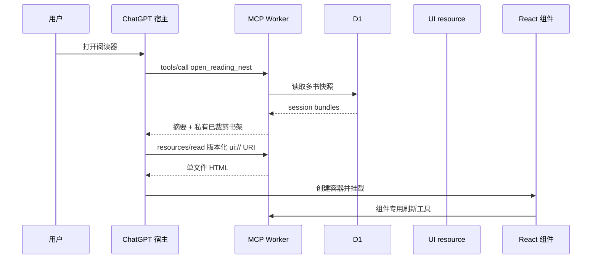

# 架构与设计思路

本文解释 Reading Nest 为什么这样设计、一次操作如何穿过各层，以及哪些边界不能混为一谈。

## 1. 产品约束

项目首先解决的是私人阅读连续性，而不是公共内容分发：

- 同一位使用者会在 Web、iPhone 和 iPad 上读多本书。
- 书籍正文、批注和阅读记录属于私密数据。
- ChatGPT 负责对话和工具选择，Worker 不额外调用模型 API。
- 设备缓存可以丢失，但云端正文和进度应能恢复。
- 只有使用者主动共读时，当前页必要内容才进入模型上下文。

因此项目采用“结构化元数据、私有正文、设备缓存、按需模型上下文”四层分离。

## 2. 三个运行主体

### ChatGPT 宿主

宿主负责发现 MCP 工具、调用工具、读取 UI resource、创建组件容器、提供 bridge，并运行模型对话。

Web、iPhone 和 iPad 都属于宿主，但它们可能有不同的缓存、尺寸、生命周期和资源挂载行为。

### Cloudflare Worker

Worker 是统一入口：

- `/health`：版本健康检查。
- `/mcp/<token>`：MCP 请求。
- `/mcp/<token>/ios-v4`：原生客户端兼容入口。
- `/source/<token>/*`：组件受控正文上传、恢复和状态同步。
- `/reader/<token>`：浏览器 fallback 阅读入口。

路径 token 适合个人部署的私密入口，但不是多用户认证系统。

### React UI resource

Vite 将 React、CSS 和运行时打包成单个 HTML。MCP 工具 descriptor 的 UI metadata 指向一个版本化 `ui://` URI，宿主读取该资源后挂载组件。

版本化 URI 既是资源地址，也是宿主缓存契约。切换 URI 可以触发重新取资源，但旧 URI 仍需作为兼容别名保留。

## 3. 数据分层

### D1

D1 使用一个 `app_state` 文档保存结构化数据库，包括 session、位置、偏好、划线想法、反应、书签和阅读记录。Repository 层负责读写与迁移，Service 层负责业务约束。

### 私有 R2

R2 保存完整正文和 source manifest。上传时计算 SHA-256、记录分段版本和数量；恢复时重新校验，避免正文与 metadata 错配。

### IndexedDB

IndexedDB 保存当前设备的正文和分段结果。它用于快速打开，不是唯一真相来源。缓存缺失时，UI 根据 source manifest 从 R2 恢复并重建缓存。

## 4. 打开阅读器的完整链路

这里有五个独立验收点：

1. MCP endpoint 可达。
2. 工具调用成功。
3. 数据正确返回。
4. UI resource 可读取。
5. 宿主成功挂载且交互可用。

原生客户端出现灰色占位块时，通常只证明宿主预留了组件区域，不证明第四或第五步成功，也不等于数据丢失。

## 5. 导入与恢复

导入流程：

1. UI 读取粘贴文本或文件。
2. TXT/Markdown 标准化换行；EPUB 提取章节正文。
3. 共享分段器生成阅读单元。
4. Worker 创建 session。
5. 正文与 manifest 写入私人 R2。
6. 元数据和阅读状态写入 D1。
7. 当前设备写入 IndexedDB。
8. 以 `sessionId` 为单位刷新整个书架集合。

恢复流程与导入相反：D1 提供 source manifest，R2 返回正文，校验 hash 和分段数量后重建 IndexedDB。

## 6. 共读链路

“和G老师共读”不直接把整页正文写进可见消息：

1. UI 发送简短、自然的共读请求。
2. 模型调用 `read_shared_page_context`。
3. 工具从 R2 取当前页，从 D1 取该页保存的想法。
4. 工具返回结构化上下文和“不复述全文”的响应策略。
5. 模型围绕用户想法回复。

这个只读工具没有 UI resource 绑定，因此不会替换或重新挂载阅读组件。

## 7. 模型可见工具与组件专用工具

模型只需要看到它必须主动选择的入口，例如：

- `open_reading_nest`
- `read_shared_page_context`

保存位置、导入、恢复、删除等维护动作由组件调用，并使用 app-only/private metadata 降低误调用与数据暴露。

`structuredContent` 面向模型；工具结果 `_meta` 可承载组件所需的私有书架快照。无论从哪个出口返回书架，服务端都应先执行隐私裁剪。

## 8. 隐私边界

`SourceManifest` 在服务端内部包含 R2 `objectKey` 与 `manifestObjectKey`。`sanitizeBookshelfBundle()` 会在书架离开内部边界前移除它们。

正文只通过私有 R2 和受控 source route 流动。公开仓库、日志、模型摘要和普通书架响应都不应该包含完整正文。

## 9. 为什么不做成公共托管服务

当前设计有一个 D1、一个 R2 bucket 和一个随机路径 token，没有账户模型。它适合个人部署；直接让陌生人共用会缺少：

- 用户认证与授权
- 每用户数据隔离
- 配额、限流和滥用防护
- 数据导出、删除和保留策略
- 审计与安全事件响应

因此开源的是“可自行部署的个人项目”，不是公开共享的 SaaS。

## 10. 重要工程经验

- 共享一份 React 代码不代表不同宿主行为相同。
- 工具成功不代表组件成功。
- 浏览器成功不代表手机客户端成功。
- 部署命令成功不代表所有边缘节点已经稳定返回新契约。
- 资源 URI 是协议和缓存的一部分，不能只当普通文件名。
- 多书支持必须用多书数据实际测试，不能从单书样本推断。
- 可见用户意图与私有模型上下文应分开传递。
- 稳定版本必须同时记录 commit、tag、应用版本、资源身份和真实设备结果。
