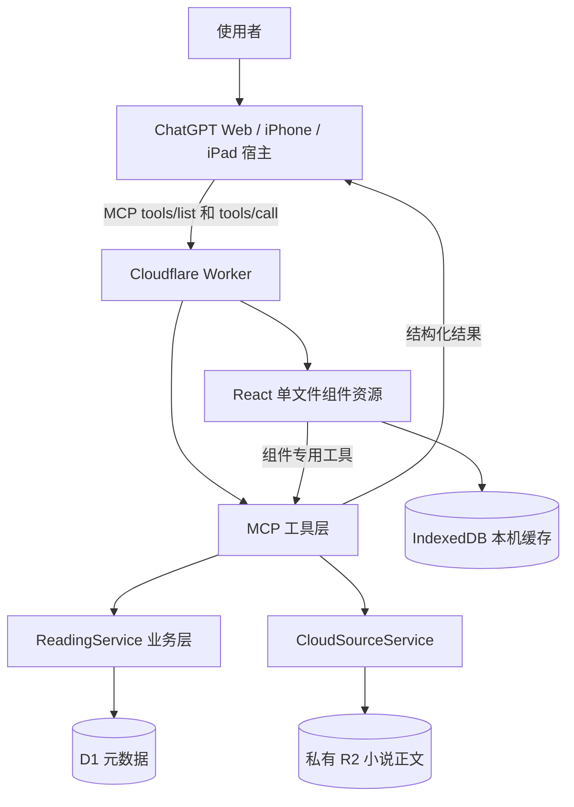
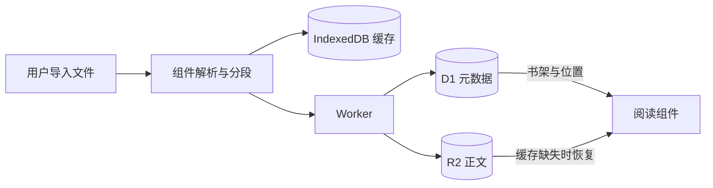
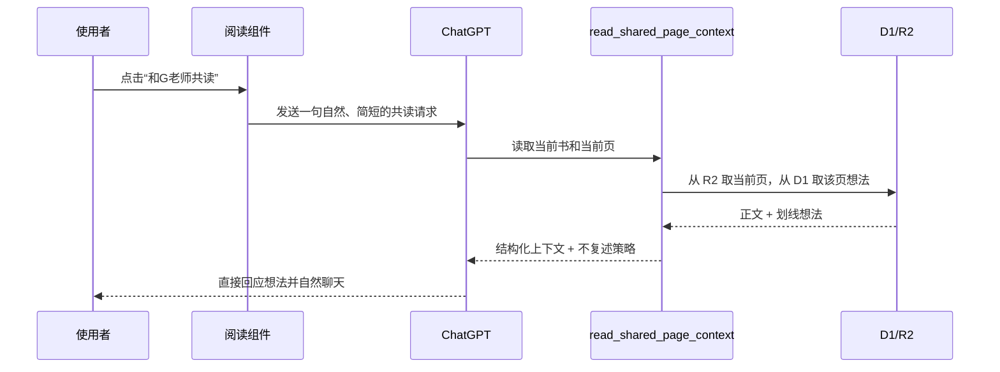

# 小说共读项目学习讲义

> 对应公开稳定标签：`v0.3.34`
>
> 目标：读完后能够解释项目如何工作、一次操作经过哪些层、出现问题时应先检查哪里，而不只是会说“帮我改一下”。

## 1. 这个项目解决什么问题

这是一个运行在 ChatGPT 里的私人阅读器。使用者可以：

- 导入 EPUB、TXT、Markdown 或粘贴文本。
- 在手机、iPad 和电脑上继续阅读。
- 保存阅读位置、划线、想法、书签和阅读记录。
- 主动把当前页及想法分享给 ChatGPT 共读。
- 在水蓝、粉桃、米白、浅绿和柔墨绿等皮肤之间切换。

它不是一个普通网页，也不是一个直接调用模型 API 的阅读器。它由三个部分协作：

1. **ChatGPT 宿主**：负责模型对话、工具调用和组件容器。
2. **MCP 服务与 Cloudflare Worker**：负责工具、数据和组件资源。
3. **React 阅读组件**：负责书架、阅读页、导入和交互。

## 2. 一张图看懂总体架构



关键理解：**Web、iPhone 和 iPad 使用的是同一份 React 组件代码，但它们是三个不同的宿主环境。** 同一份代码不等于一定有相同的挂载、缓存和桥接行为。

## 3. 技术栈及用途

| 技术 | 在项目里的用途 |
| --- | --- |
| TypeScript | 给前后端和共享数据模型提供类型约束 |
| React 19 | 实现书架、阅读器、导入页和设置界面 |
| Vite | 构建前端，并通过 singlefile 插件打成一个 HTML 组件资源 |
| MCP SDK | 定义 ChatGPT 能发现和调用的工具 |
| MCP Apps / ext-apps | 把工具结果与嵌入式 UI 组件连接起来 |
| Zod | 校验每个工具的输入结构 |
| Cloudflare Worker | 承载线上 MCP、组件资源和正文受控接口 |
| D1 | 保存书籍元数据、位置、偏好、划线、想法、书签和记录 |
| R2 | 私密保存小说正文 |
| IndexedDB | 在当前设备缓存正文，加快打开速度 |
| Vitest | 验证共享层、服务端和前端行为 |
| Wrangler | 构建并部署 Cloudflare Worker |

项目不需要 `OPENAI_API_KEY`。模型能力由 ChatGPT 宿主提供，Worker 不直接请求另一个模型服务。

## 4. 代码目录怎么读

```text
shared/
  src/models.ts                 核心数据模型
  src/tool-schemas.ts           MCP 工具输入校验
  src/novel-segmentation.ts     小说分段算法
  src/app-version.ts            应用版本与 UI 资源身份

server/
  src/worker.ts                 Cloudflare Worker 总入口
  src/mcp/register-tools.ts     工具描述、权限和处理函数
  src/mcp/register-resource.ts  注册嵌入式 UI 资源
  src/services/reading-service.ts
                                阅读业务逻辑
  src/services/cloud-source-service.ts
                                R2 正文上传、恢复和校验
  src/repositories/             D1/JSON 数据访问
  src/privacy/                  对外结果的隐私裁剪

web/
  src/App.tsx                   主要界面和阅读流程
  src/bridge/host.ts            ChatGPT 宿主桥接
  src/bridge/sync-current-context.ts
                                当前上下文同步与消息发送
  src/features/                 导入、缓存、正文恢复等功能
```

建议阅读顺序：`models.ts` -> `register-tools.ts` -> `worker.ts` -> `host.ts` -> `App.tsx`。先看数据和契约，再看界面细节。

## 5. 数据为什么分三处保存

### D1：可查询的结构化元数据

D1 保存：

- 书籍 session 和标题。
- 当前阅读位置与 ChatGPT 已同步位置。
- 皮肤、评论模式等偏好。
- 划线、想法、书签、反应和阅读记录。
- R2 正文对象的内部元数据。

### R2：私有正文

R2 保存完整小说正文。正文不会放在 D1，也不会作为公共 URL 发布。恢复正文时会校验内容 hash 和分段数量，防止拿到错误文件。

### IndexedDB：设备缓存

IndexedDB 保存当前设备上的正文和分段结果，用于快速打开。它是缓存，不是唯一真相来源。缓存丢失时，组件可以根据 D1 的元数据从私有 R2 恢复正文。



## 6. 导入一本书时发生了什么

1. 组件读取文件或粘贴文本。
2. EPUB 会提取章节正文，TXT/Markdown 会标准化换行。
3. 分段算法生成阅读单元，用户界面把它们称为“页”。
4. 创建阅读 session。
5. 正文写入私有 R2。
6. source manifest 和阅读元数据写入 D1。
7. 正文与分段结果写入当前设备 IndexedDB。
8. 书架重新读取的是一个多书集合，不是只补一份样本书。

书架支持十几本、二十几本书的关键不是“多画几张卡片”，而是服务端、组件状态和缓存都必须以 `sessionId` 区分每一本书。

## 7. 打开阅读器时发生了什么

ChatGPT 调用模型可见工具 `open_reading_nest`：

1. Worker 从 D1 获取多书快照。
2. 服务端裁掉 R2 的 `objectKey` 等内部字段。
3. 简短书架摘要放入模型可见文本，供模型理解当前状态。
4. 已裁剪的多书书架放入组件私有 `_meta.privateBookshelf`。
5. 工具 descriptor 的 UI metadata 指向版本化 resource URI。
6. ChatGPT 宿主读取单文件 HTML 资源并挂载 React 组件。

这解释了一个重要现象：**工具返回成功不等于组件挂载成功。** 工具、数据、资源和宿主挂载是四个独立状态。

## 8. “和G老师共读”现在如何工作

旧方案把整页正文和所有想法拼进可见聊天消息。这样模型一定能看到，但使用体验像复读机。

当前方案把“对话”与“取数据”分开：



`read_shared_page_context` 是只读、模型可见、没有 UI 资源绑定的工具。它只在使用者明确要求共读当前页时使用。返回结果包含：

- 书名和当前页位置。
- 当前页正文。
- 当前页已保存的划线和想法。
- `doNotRepeatFullPage`、`doNotTranscribeThoughts` 等回应策略。

因此可见聊天里不再展示整页正文，模型仍然能拿到讨论所需的信息。

## 9. MCP 工具为什么分“模型可见”和“组件专用”

模型可见工具只有真正需要 ChatGPT 主动选择的能力，例如：

- `open_reading_nest`
- `read_shared_page_context`

导入、保存划线、更新位置等工具由组件内部调用，并设置为 app-only/private。这样可以：

- 减少模型误调用。
- 避免把内部维护操作展示给使用者。
- 保持正文和书架私有字段只在必要范围内流动。

理解 MCP 时，要区分三个概念：

- **工具描述**：告诉模型什么时候调用。
- **工具结果 `structuredContent`**：模型可使用的结构化数据。
- **工具结果 `_meta`**：组件或宿主使用的私有附加数据。

## 10. 为什么浏览器成功，iPhone 仍可能灰屏

灰色占位块通常说明：ChatGPT 已经开始为组件预留位置，但宿主没有完成组件挂载。可能涉及：

- 连接仍缓存旧的工具列表。
- 工具 descriptor 和 result 指向不同的 resource URI。
- 新资源身份尚未在边缘节点稳定传播。
- iPhone 宿主没有成功读取或挂载资源。
- 宿主桥接握手没有完成。

它不等于：

- 书籍丢失。
- D1 或 R2 一定损坏。
- React 一定报错。
- 工具没有执行。

当前公开版本使用自包含资源身份 `app-v82-native-inline`，并保留旧 URI 作为兼容别名。原生客户端使用独立兼容入口建立连接，可以避免旧连接继续持有过期的工具和资源绑定。

## 11. 正确的排错层次

遇到问题时按顺序判断：

1. `/health` 是否返回当前版本。
2. MCP `initialize` 是否成功。
3. `tools/list` 是否有正确工具和资源 URI。
4. `tools/call` 是否返回预期结构。
5. `resources/list` 是否列出资源。
6. `resources/read` 是否能读取完整 HTML。
7. ChatGPT Web 是否挂载。
8. iPhone 是否挂载并可交互。
9. iPad 是否挂载并可交互。

不要跳步，也不要用第 7 步代替第 8、9 步。

## 12. 这次项目最重要的错误与经验

### 错误一：把浏览器成功当成客户端成功

改进：建立独立的 Web、iPhone、iPad 验收行，真机没有确认就只能写“未验证”。

### 错误二：工具调用成功就宣称组件成功

改进：分别验证工具结果、资源读取和宿主挂载。

### 错误三：为确保模型看到内容，把全文塞进聊天

改进：用只读上下文工具取数据，可见消息只表达用户意图。

### 错误四：单书样本掩盖集合问题

改进：按多书快照设计并测试，所有缓存、位置和操作都用 `sessionId` 隔离。

### 错误五：版本更新破坏已工作的客户端资源身份

改进：资源 URI 是客户端契约的一部分。保留旧 URI，并在真实设备验证新身份后再接受。

## 13. 测试与验收

稳定版本的自动检查：

- shared：34 项通过。
- server：87 项通过。
- web：173 项通过，1 项按原设计跳过。
- 生产构建成功。

自动测试仍不能替代真机。最终验收需要：

| 环境 | 组件挂载 | 书架数据 | 阅读交互 | 共读不复述 |
| --- | --- | --- | --- | --- |
| ChatGPT Web | 已验证冻结版本 | 已验证冻结版本 | 已验证冻结版本 | 已验证冻结版本 |
| iPhone ChatGPT | 已验证冻结版本 | 已验证冻结版本 | 已验证冻结版本 | 已验证冻结版本 |
| iPad ChatGPT | 需要独立验证 | 需要独立验证 | 需要独立验证 | 需要独立验证 |

本标签是在使用者确认核心客户端流程完成后建立的稳定点。

## 14. 隐私与安全边界

- 不提交 MCP 私密路径、Cloudflare token 或任何 secret。
- 不把书籍正文、私人聊天和阅读记录写进仓库或教学文档。
- R2 bucket 保持 private。
- 对外书架结果统一裁掉内部对象 key。
- 只有使用者主动触发共读时，当前页必要范围才进入模型上下文。
- 删除功能要区分 D1 记录、R2 正文和设备缓存三个层次。

当前方案是个人单用户部署。要公开给多人使用，必须重新设计认证、授权和数据隔离。

## 15. 给自己的学习路线

### 第一课：数据模型

阅读 `shared/src/models.ts`，回答：一本书、一个位置、一条划线分别如何被唯一识别？

### 第二课：输入契约

阅读 `shared/src/tool-schemas.ts`，试着解释 Zod 为什么能阻止错误参数进入服务层。

### 第三课：MCP 工具

阅读 `server/src/mcp/register-tools.ts`，找出模型可见工具与 app-only 工具的区别。

### 第四课：数据存储

对比 `ReadingService` 和 `CloudSourceService`，解释为什么元数据和正文要分开。

### 第五课：组件挂载

阅读 `register-resource.ts` 与 `host.ts`，画出工具调用到 React 出现之间的步骤。

### 第六课：共读链路

从 `shareNovelPage()` 开始，追踪短消息如何引导模型调用 `read_shared_page_context`。

### 第七课：测试

挑一个工具测试，先读输入、假数据、调用和断言，再尝试增加一个失败用例。

### 第八课：部署与验收

使用维护手册做一次只读检查，并说明“线上协议通过”和“iPhone 真机通过”为什么不是同一句话。

## 16. 可以直接交给 ChatGPT 老师的教学提示

```text
请把《小说共读项目学习讲义》当作课程大纲，按八节课教我。
我不是程序员基础很强的学生，请每次只讲一层：
1. 先用生活类比解释；
2. 再指出项目中的具体文件；
3. 给我一个不超过 15 分钟的小练习；
4. 用 3 个问题检查我是否真的理解；
5. 我答完再进入下一课。
不要一次把全部代码讲完，也不要只给结论。
```

学完后的目标不是独立写完整项目，而是能够提出更准确的问题，例如：

- “工具结果正常，但 iPhone 资源没有挂载，请检查 resource URI 和宿主缓存。”
- “这条数据应该属于 D1、R2 还是 IndexedDB？”
- “这个修改需要哪几条真实设备验收？”

当你能这样描述问题时，就已经从“只会发指令”进入“能参与设计和验收”的阶段了。
